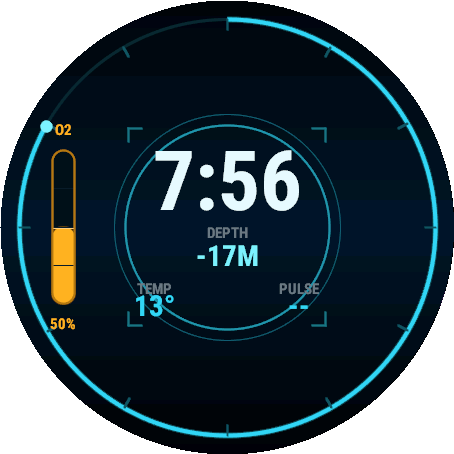

# Abyss

A Subnautica-flavored **dive-computer HUD** watch face for the **Garmin tactix 8**,
written in Monkey C for Connect IQ.

The face reads like an underwater PDA / dive-computer readout — deep abyss-blue
background, cyan/amber HUD accents, thin glowing linework:

- **Outer depth ring** — an arc sweeping the bezel like a descent gauge, mapped to
  the day's progress (midnight → now). Flip one constant to track steps instead.
- **O2 / air gauge** — the device battery drawn as an air-supply tank on the left that
  drains as the battery drops: **cyan when full → amber → red when low**. (Thematically:
  a half-full air tank reads amber, like a real dive computer's caution band.)
- **Center HUD** — the large **time** (12/24h follows the device), a **DEPTH** line
  driven by the barometric altimeter (your elevation on land), and small **TEMP** /
  **PULSE** fields.
- **Sonar ping** — a subtle cyan ring that pulses outward, **active state only**
  (killed entirely in always-on).

Everything is drawn **procedurally** and laid out in percentages of
`dc.getWidth()/getHeight()` + the screen center, so it scales cleanly across every
panel with **no hardcoded pixel coordinates** — and it **compiles and renders
complete with zero image assets**. Generated art is an optional drop-in (see below).



## Hardware / scaling

The tactix 8 runs on the **Fenix 8 (AMOLED)** platform. Connect IQ has no dedicated
`tactix8` product id, so the project targets the Fenix 8 products that share the
identical hardware and resolution:

| Product id      | Resolution | Panel | Case            |
|-----------------|------------|-------|-----------------|
| `fenix847mm`    | 454×454    | AMOLED | tactix 8 51mm  |
| `fenix843mm`    | 416×416    | AMOLED | tactix 8 47mm  |
| `fenix8pro47mm` | 454×454    | AMOLED | Fenix 8 Pro    |
| `fenix8solar51mm` | 280×280  | MIP   | Fenix 8 Solar 51mm |
| `fenix8solar47mm` | 260×260  | MIP   | Fenix 8 Solar 47mm |

## Always-on display

Two render paths share one `onUpdate()`:

- **Active mode** — full brightness, abyss gradient, gauge fills, sonar pulse.
- **Always-on / low-power** (`mIsSleep`, AMOLED only) — burn-in-safe: dim time, a thin
  depth-ring outline, a thin O2 outline + level tick, **no large bright fills, no
  sonar**. All lit pixels shift a few px each minute (`requiresBurnInProtection`).
  `onPartialUpdate()` only repaints on the minute change, staying inside the AOD power
  budget. MIP / transflective panels have no burn-in and always render the full face.

`onEnterSleep()` / `onExitSleep()` toggle the state and request a repaint.

## Data sources

All live values are read defensively (`has` checks + try/catch) and degrade to a
blank `--` field rather than crashing if a sensor is unavailable:

| Field | API |
|-------|-----|
| Time | `System.getClockTime()` (12/24h via `getDeviceSettings().is24Hour`) |
| O2 gauge (battery) | `System.getSystemStats().battery` |
| Depth ring (day) | `System.getClockTime()` → fraction of 86 400 s |
| Depth ring (steps) | `ActivityMonitor.getInfo()` `steps` / `stepGoal` |
| DEPTH (elevation) | `Activity.getActivityInfo().altitude` (barometric, meters) |
| TEMP | `Weather.getCurrentConditions().temperature` (°C) |
| PULSE | `Activity.getActivityInfo().currentHeartRate` |

No special permissions are required, so `manifest.xml` declares none.

## Settings

Editable in Garmin Connect / the simulator's **App Settings**:

- **Step Goal Override** — steps for a full depth ring *when the ring is in steps mode*
  (`0` = the watch's own step goal).
- **Show Seconds** — reserved toggle (parity / future use).

## Build & run

Prerequisites: the **Connect IQ SDK** and a JDK. Paths live in `build_config.json`
(auto-created on first run) — edit them to match your machine:

```json
{
  "JavaHome": "C:\\Program Files\\Android\\openjdk\\jdk-21.0.8",
  "SdkDir":   "C:\\Users\\<you>\\AppData\\Roaming\\Garmin\\ConnectIQ\\Sdks\\<sdk-version>"
}
```

### Build (default device = `fenix847mm`, 454×454)

```powershell
./build.ps1                       # build bin/Abyss.prg
./build.ps1 -Device fenix843mm    # build the 416×416 variant
./build.ps1 -Device fenix8solar51mm   # build a MIP variant
./build.ps1 -Export               # package a store-ready bin/Abyss.iq (all devices)
```

### Build + launch in the simulator

```powershell
./build.ps1 -Run                  # or double-click run_simulator.bat
```

In the simulator, exercise the design via the menus:
- **Settings → Battery** to drain the O2 gauge (watch it shift cyan → amber → red).
- **Simulation → Sensors → Altitude** to move the DEPTH readout.
- **Simulation → Weather** for TEMP; **Sensors → Heart Rate** for PULSE.
- **Settings → Display → Always On** to preview the burn-in-safe low-power path.

### Screenshot

With the face running in the simulator:

```powershell
./savescreenshot.ps1              # writes assets/screen_active.png (round-masked, 1:1)
```

The script auto-resolves the device directory from the simulator window title and
captures the display region at native resolution, so it works for any panel size.

### Sideload to the watch

1. Build the `.prg`.
2. Connect the tactix 8 by USB; it mounts as a drive.
3. Copy `bin/Abyss.prg` to `GARMIN/APPS/` on the device.
4. Eject and select **Abyss** from the watch face list.

For store distribution, upload the `.iq` from `./build.ps1 -Export`.

## Generated art assets

The face is **fully procedural** — it looks complete with no art. Each asset below is
an **optional enhancement**. To use one:

1. Generate the PNG to the **exact pixel size** for the panel.
2. Save it over the placeholder at the path in the table (the shipped placeholders are
   tiny transparent PNGs so the project compiles as-is).
3. For a panel-specific size, drop it into the matching `resources-round-<W>x<H>/drawables/`
   folder and declare it there; otherwise the base `resources/drawables/` copy is used
   on every device.
4. Flip the matching **`USE_ART_*`** flag at the top of `source/AbyssView.mc`
   (`USE_ART_BG`, `USE_ART_FRAME`, `USE_ART_SONAR`). Two assets
   (`o2_gauge_housing`, `depth_ring`) are declared for drop-in but not yet wired — add a
   `loadResource` + `drawBitmap` hook where noted in the source if you want them.

**Shared art direction for every asset:** abyss-blue / cyan / amber palette
(`#33D6F0` cyan, `#7CF2FF` highlight, `#FFB020` amber, `#FF4530` low-red, on
near-black blue `#02060E`–`#010308`); thin HUD linework, subtle outer glow, an
underwater dive-computer PDA feel; **transparent PNG** unless noted.

| Asset (base path under `resources/drawables/`) | 454×454 | 416×416 | Style spec |
|---|---|---|---|
| `bg_vignette.png` *(wired: `USE_ART_BG`)* | 454×454 | 416×416 | Full-screen **opaque** background. Radial abyss vignette: faint blue-teal glow toward center fading to near-black at the edges, optional faint caustic/light-shaft streaks and a few drifting particle motes. No HUD elements (those draw on top). Also make 280×280 + 260×260 for MIP if desired (keep it dark + low-detail). |
| `hud_frame.png` *(wired: `USE_ART_FRAME`)* | 454×454 | 416×416 | Full-screen **transparent** overlay: thin cyan reticle/bracket frame — corner ticks, fine crosshair guides, a few engraved depth-scale marks around the bezel. Slight glow. Drawn over the HUD. |
| `o2_gauge_housing.png` | ~80×320 | ~74×294 | Transparent **portrait** capsule: a metallic/glassy air-tank housing with rivets + segment ticks, empty interior (the cyan/amber fill draws inside it). Anchored on the left third of the face. |
| `sonar_ring.png` *(wired: `USE_ART_SONAR`)* | 454×454 | 416×416 | Full-screen **transparent**: one or more concentric cyan sonar ping rings centered, brightest inner ring fading outward, soft glow. Replaces the procedural ping when enabled. |
| `depth_ring.png` | 454×454 | 416×416 | Transparent **ring texture** for the outer bezel: fine tick marks + a faint cyan gradient track. Optional — the procedural ring already draws ticks + a progress arc; this is purely a texture underlay. |
| `launcher_icon.svg` | 48×48 | — | Already provided (vector). App-list icon: abyss disc + cyan depth arc + O2 tank + sonar rings. Edit `resources/drawables/launcher_icon.svg` to restyle. |

## Fonts

Abyss renders text with **Connect IQ vector fonts** (`RobotoCondensedBold`, scaled to
the panel in `initFonts()`), which give the clean technical PDA look with no font files
to ship. Built-in fonts are the last-resort fallback.

If you want a custom **bitmap** display font instead, Connect IQ needs an AngelCode
`.fnt` + `.png` atlas (it can't consume a `.ttf` at build time). Bake one per panel
size, declare it in a `resources*/fonts/fonts.xml`, and load it via `Rez.Fonts.<id>` in
`initFonts()` ahead of the vector fallback. (The sibling Sanctuary project's
`tools/gen_fonts.py` is a working reference for that pipeline.)

## Customizing

- **What the depth ring tracks:** `RING_MODE` at the top of `AbyssView.mc`
  (`0` = day progress, `1` = steps).
- **O2 color thresholds:** `O2_WARN` / `O2_LOW` constants (battery % where the gauge
  warms to amber / goes red).
- **Palette:** the `C_*` color constants (abyss background, cyan, amber, red, text).
- **Layout anchors:** the percentage multipliers in `onUpdate()` and each element's
  draw helper.
- **Elevation units / label:** `getElevationStr()` (swap meters→feet, or flip the sign
  for a true "depth below surface" feel). Temperature unit in `getTempStr()`.
- **Optional art:** the `USE_ART_*` flags + the asset table above.
